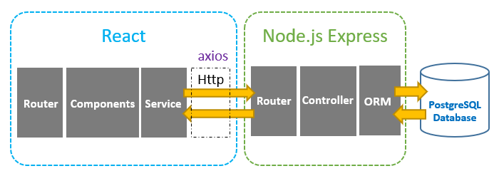
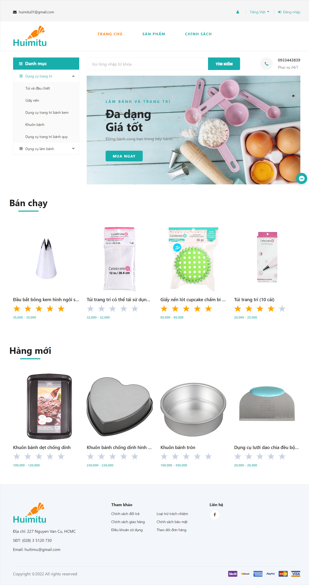
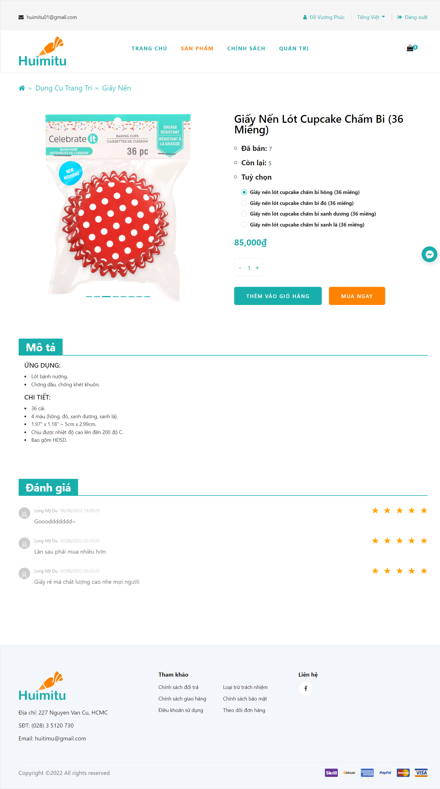

# Huimitu

## Introduction

An Ecommerce website to sell bakery accessories with B2B model. Because of being a SPA (Single Page Application) website, we have decided to use 3-tiers model (PERN stack application) to build it up:

- ReactJS to build up the front-end
- ExpressJS to create RESTful API
- Postgre database to store data

  

## Features

The website statisfied all the basic features of an Ecommerce website including:

- Sign up account
- Login account
- Login account with Google
- View product list with sort, filter and full-text search
- View product detail
- Add product to cart
- Add shipping information
- Checkout cart with Momo, Paypal, Ship COD
- Voucher
- Buy now
- Rating product after buying

Futhermore, we also implements advanced features:

- Admin features
- Upload user avatar
- Statistic using Tableau
- Recommend related product using KNIME (frequent-itemset mining)
- Multi-language (English, Vietnamese)
- Facebook Messenger chatbot

## Gallery

  

  Landing page

  

  Product detail

## Video demo

<iframe width="560" height="315" src="https://www.youtube.com/embed/chOa7hNwW34" title="YouTube video player" frameborder="0" allow="accelerometer; autoplay; clipboard-write; encrypted-media; gyroscope; picture-in-picture" allowfullscreen></iframe>

## Tech stack

  
  
  

  
  
  
  

  
  

## Contribution

The project belongs to our Huimitu teams including:

- [thanhhoang4869](https://github.com/thanhhoang4869)
- [phuc16102001](https://github.com/phuc16102001)
- [LongMyDu](https://github.com/longmydu)
- [nnhatdu](https://github.com/nnhatdu)
- [nhkduy201](https://github.com/nhkduy201)

**Please do not copy without asking for permission**
