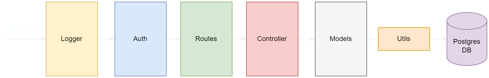

# Huimitu - Backend

## Instruction

After cloning the project, firstly you need to install all the required packages using:
```bash
$ npm install
```

If you did not have the database, use the `db-script` folder to create it:
- Run `create-db.sql` to create database
- Run `create-schema.sql` to create tables

Before starting the server, you need to change the configuration as your system:
- Change the password of postgres database in `config.js`

Subsequently, for security purpose, some environment variables need to be specified. Create `.env` in the current directory:
```bash
DB_PASSWORD = <YOUR_DATABASE_PASSWORD>
JWT_SECRET = <YOUR_JWT_SECRET_KEY>
```

Finally, to start the server, run:
```bash
$ npm start
```

## Exploring source code

In the server, we use the middleware architecture as following:
- The request first logged in by using the `log.mdw.js` middleware
- Then it check for the authorization layer `auth.js` to check for token/session (if required)
- After that, the request will be routed by `routes.js`
- The logical business flows are implemented in the `controller.js` layer
- And the deepest layer is `models.js` which use `utils/db.js` to query the database
  
<p align="center">
  
</p>